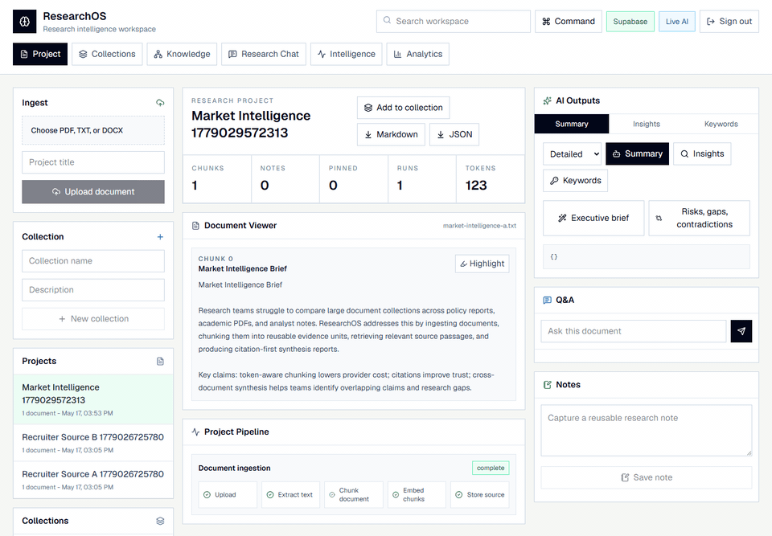
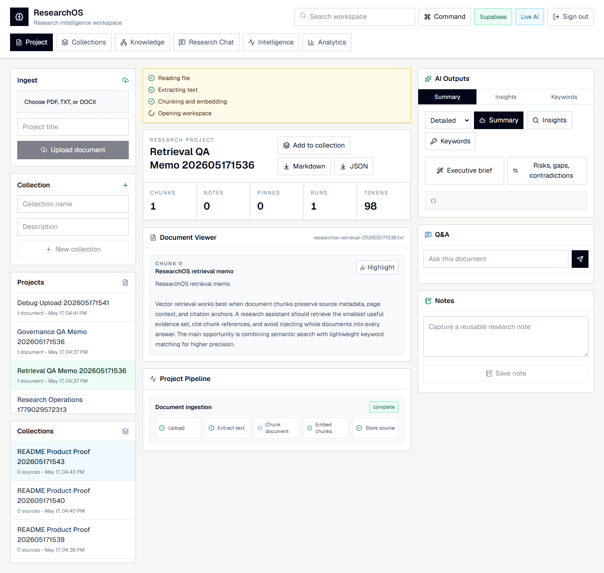
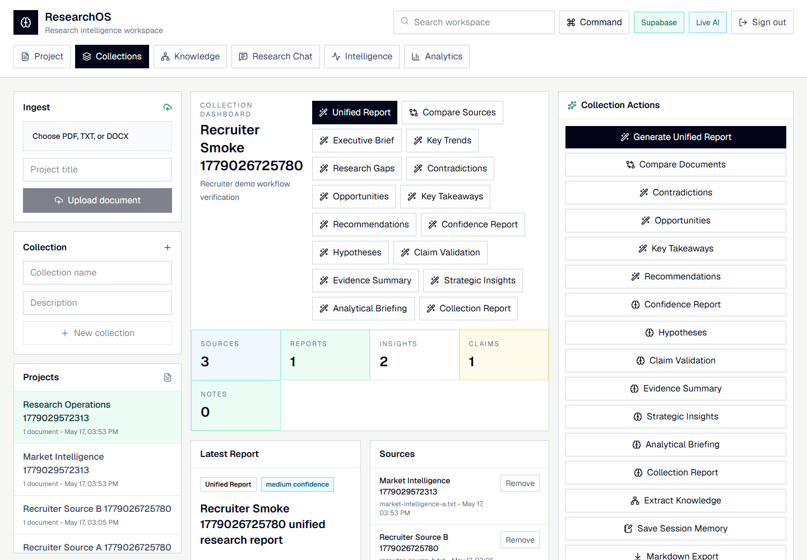
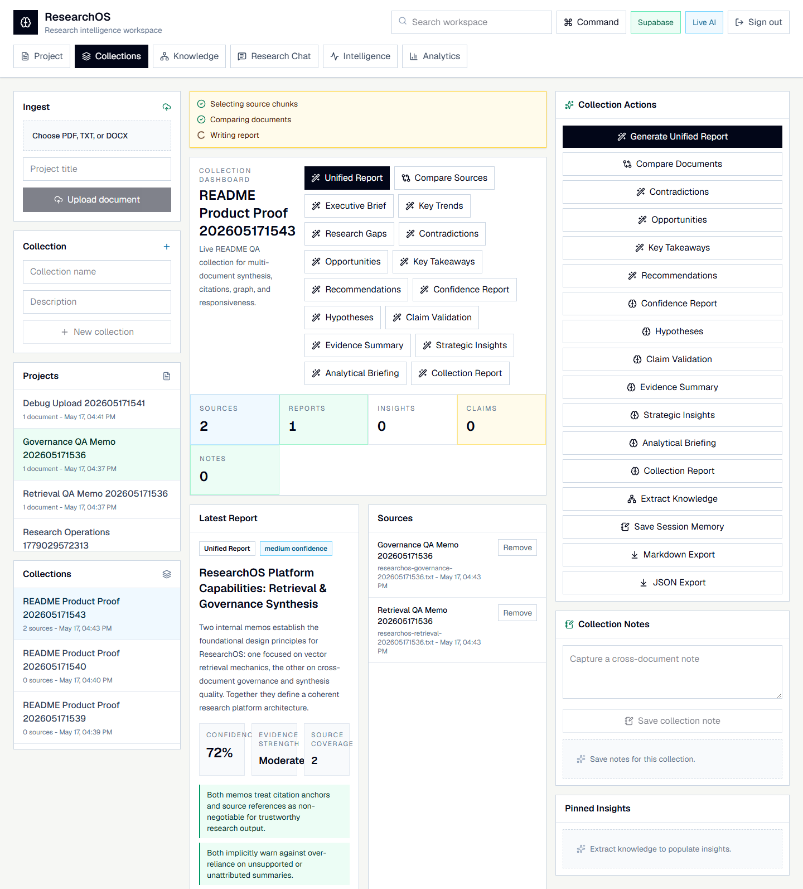
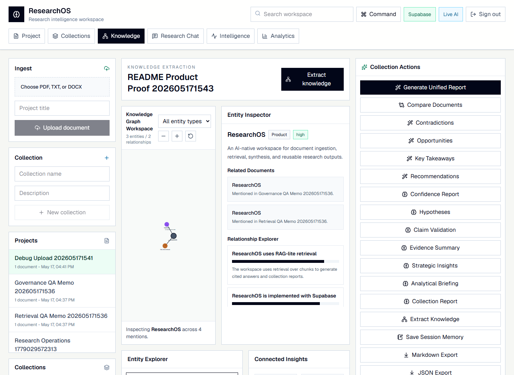
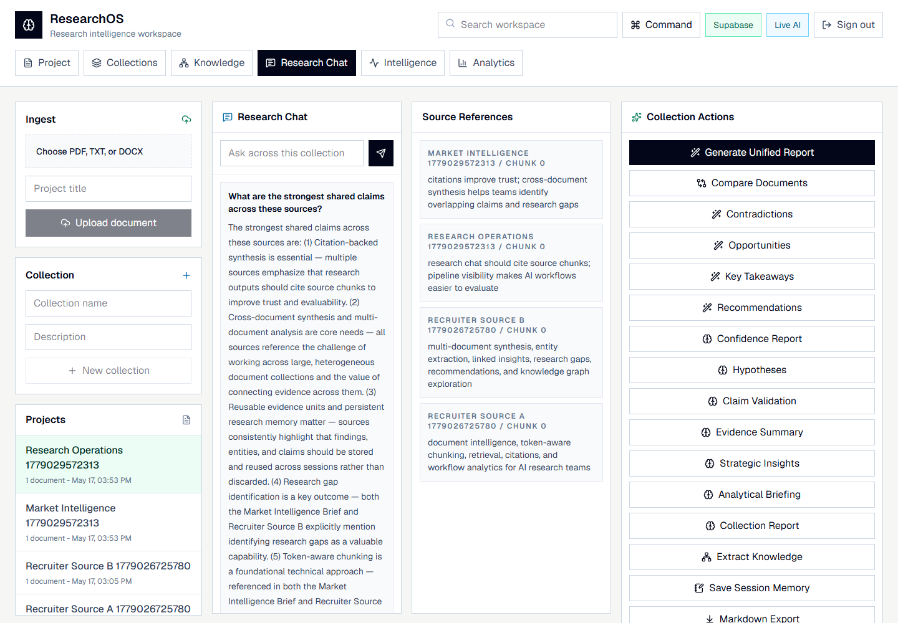
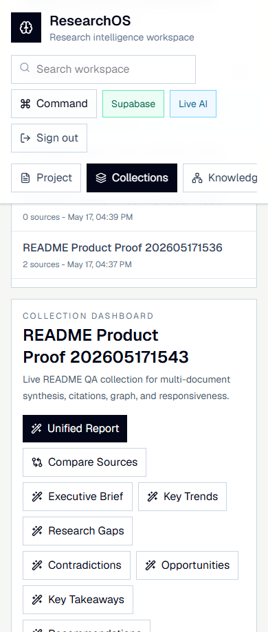
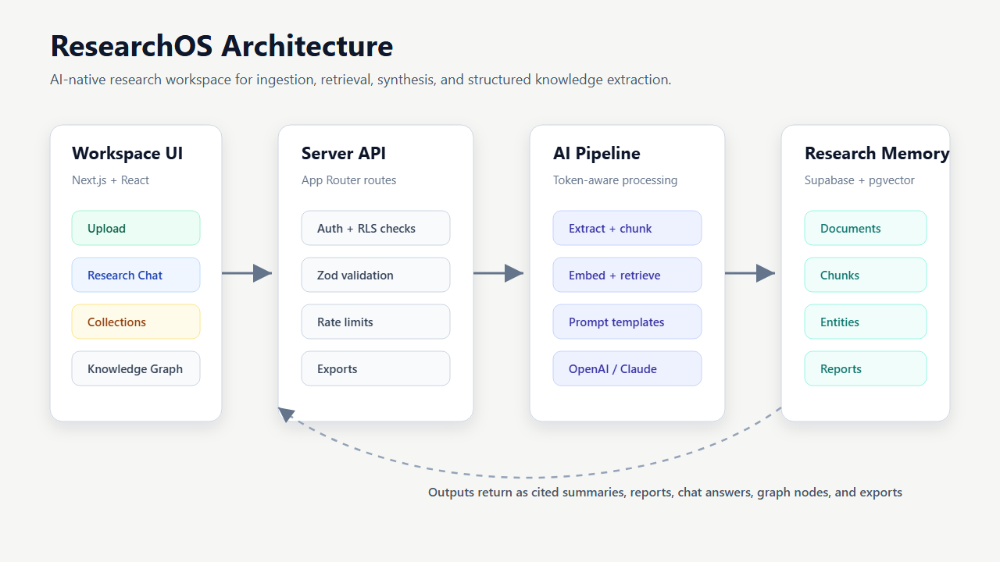
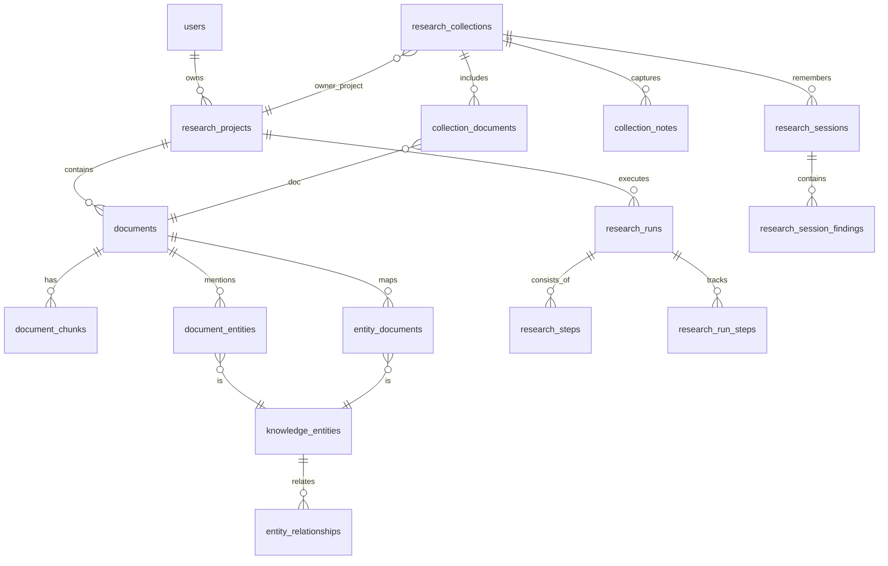

# ResearchOS

<div align="center">

**AI Research Intelligence Workspace for multi-document synthesis, cited Q&A, and structured knowledge extraction.**

[**Live Demo**](https://ai-research-assistant-liart.vercel.app) · Next.js · Supabase · pgvector · OpenAI / Claude · TypeScript



</div>

---

## Demo Access

| Item | Value |
| --- | --- |
| Live app | [ai-research-assistant-liart.vercel.app](https://ai-research-assistant-liart.vercel.app) |
| Email | `recruiter@researchos.dev` |
| Password | `ResearchOS-Demo-2026!` |

> Shared portfolio account. Use non-confidential test documents, or create a separate account from the sign-up screen.

---

## Why ResearchOS

ResearchOS helps researchers, analysts, students, and AI teams turn unstructured document collections into reusable research intelligence.

Most AI document tools summarize one file at a time. ResearchOS is built for the more realistic workflow: upload multiple sources, retrieve the right evidence, compare findings, extract entities, ask cited questions, and export a reusable report.

---

## What To Try

| In the live app | What it proves |
| --- | --- |
| Upload two short TXT/PDF/DOCX files | File ingestion, text extraction, chunking, and project creation |
| Create a collection and add both documents | Multi-document research workspace behavior |
| Generate a unified report | Cross-document synthesis with citations and confidence signals |
| Ask a collection question | RAG-style retrieval across multiple sources |
| Open Knowledge | Entity extraction, relationships, and linked insights |
| Open Analytics | Token estimates, provider usage, and workflow metrics |

---

## Product Tour

Captured from the deployed Vercel app with the public recruiter login.

| Dashboard | Collection Workspace |
| --- | --- |
|  |  |

| Synthesis Report | Knowledge Graph |
| --- | --- |
|  |  |

| Research Chat | Mobile Workspace |
| --- | --- |
|  |  |

---

## Technical Highlights

| Area | Implementation |
| --- | --- |
| Retrieval | pgvector semantic search, chunk-level citations, hybrid lexical fallback |
| AI pipeline | Token-aware chunking, prompt templates, structured Zod-validated outputs |
| Multi-document reasoning | Collections, unified reports, source comparison, gaps, contradictions, recommendations |
| Knowledge layer | Entities, claims, linked insights, relationships, entity detail routes |
| Research memory | Notes, pins, saved sessions, exports, cached outputs |
| Platform | Supabase Auth, Storage, Postgres, RLS policies, server-side AI calls |
| Reliability | Demo fallback mode, rate limits, typed API contracts, lint/build/test verification |

---

## Architecture



| Layer | Responsibility |
| --- | --- |
| Workspace UI | Uploads, projects, collections, chat, knowledge graph, analytics, exports |
| Server API | Auth checks, validation, rate limits, document processing, export generation |
| AI pipeline | Chunking, retrieval, prompt templates, provider calls, structured output validation |
| Research memory | Supabase Storage, Postgres, pgvector chunks, entities, reports, sessions |

<details>
<summary>Database ER diagram</summary>



</details>

---

## Stack

| Layer | Technology |
| --- | --- |
| App | Next.js App Router, React 19, TypeScript |
| UI | Tailwind CSS, lucide-react |
| Backend | Next.js API routes, Zod validation |
| Data | Supabase Auth, Storage, Postgres, pgvector |
| AI | OpenAI embeddings / chat, Anthropic Claude chat |
| Quality | Vitest, ESLint, npm audit |

---

## Local Setup

```bash
npm install
Copy-Item .env.example .env.local
npm run dev
```

<details>
<summary>Required environment variables</summary>

```bash
NEXT_PUBLIC_SUPABASE_URL=
NEXT_PUBLIC_SUPABASE_ANON_KEY=
SUPABASE_SERVICE_ROLE_KEY=
SUPABASE_SECRET_KEY=

OPENAI_API_KEY=
OPENAI_CHAT_MODEL=gpt-4o-mini
OPENAI_EMBEDDING_MODEL=text-embedding-3-small

ANTHROPIC_API_KEY=
ANTHROPIC_MODEL=claude-sonnet-4-6
AI_PROVIDER=anthropic

DEMO_MODE=false
```

Apply Supabase migrations in `supabase/migrations` from `0001` through `0007`.

</details>

---

## Verification

```bash
npm run lint
npm test
npm run build
npm audit --omit=dev
```

Latest live smoke test covers recruiter login, document upload, collection creation, multi-document synthesis, knowledge extraction, the knowledge graph, analytics, and export-ready workspace state.
