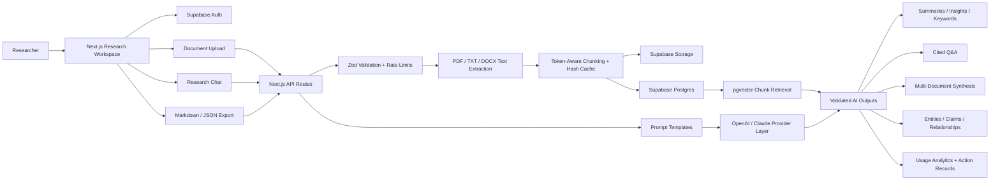
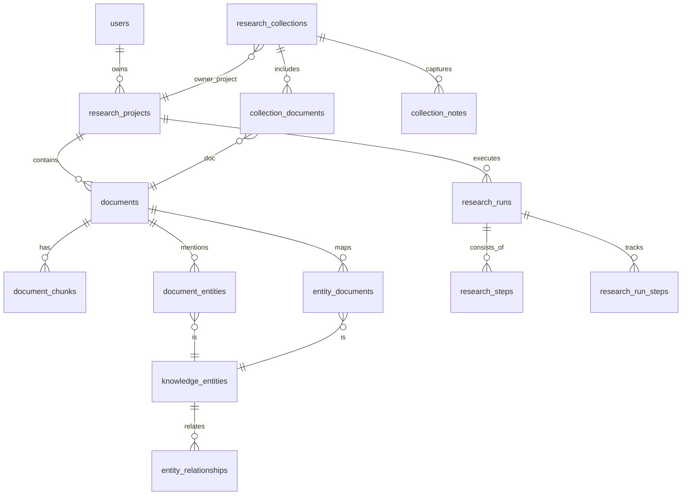

# ResearchOS

ResearchOS is a portfolio-grade AI research intelligence workspace built with Next.js, Supabase, and server-side AI provider integrations. It ingests documents, chunks and stores source text, retrieves relevant context, generates structured research outputs, supports cited Q&A, synthesizes across collections, and exports reusable research artifacts.

## Features

- PDF, TXT, and DOCX ingestion with raw text extraction.
- Supabase Auth, Storage, Postgres metadata, and pgvector retrieval.
- Token-aware chunking, content hashing, caching, and selective context injection.
- Reusable prompt templates for summaries, insights, keywords, and Q&A.
- OpenAI primary provider with optional Claude abstraction.
- Demo AI fallback when provider keys are not configured.
- Multi-document collections with unified reports, source comparisons, executive briefs, trend analysis, and research gap workflows.
- Knowledge extraction for entities, linked insights, and source-backed claims.
- Collection notes, source removal, contradiction analysis, opportunity analysis, key takeaways, and recommendation summaries.
- Usage analytics for token estimates, provider mix, processing time, and retrieval efficiency.
- Persistent Supabase-backed rate limits and action records when the service role key is configured.
- Research workspace UI with document viewer, notes, highlights, pinned answers, collection chat, command palette, and Markdown/JSON exports.

## Architecture Schematic



## Database Schema



## Local Setup

```bash
npm install
Copy-Item .env.example .env.local
npm run dev
```

Live demo: https://ai-research-assistant-liart.vercel.app

If Supabase env vars are absent, the app runs with an in-memory demo workspace. If AI keys are absent or `DEMO_MODE=true`, AI routes return deterministic demo outputs while preserving the same API contracts.

## Environment

```bash
NEXT_PUBLIC_SUPABASE_URL=
NEXT_PUBLIC_SUPABASE_ANON_KEY=
SUPABASE_SERVICE_ROLE_KEY=
OPENAI_API_KEY=
OPENAI_CHAT_MODEL=gpt-4o-mini
OPENAI_EMBEDDING_MODEL=text-embedding-3-small
ANTHROPIC_API_KEY=
ANTHROPIC_MODEL=claude-3-5-sonnet-latest
AI_PROVIDER=openai
DEMO_MODE=false
```

Never commit real API keys. If a key has been pasted into chat or logs, rotate it before deploying.

## Supabase

Apply the migrations in `supabase/migrations` in order. `0001_researchos.sql` creates:

- `research_projects`
- `documents`
- `document_chunks` with `vector(1536)` embeddings
- `ai_outputs`
- `research_notes`
- `highlights`
- `qa_messages`
- `research_exports`
- `match_document_chunks(...)` RPC for pgvector search
- private `research-documents` storage bucket policies

`0002_research_intelligence_workspace.sql` adds:

- `research_collections`
- `collection_documents`
- `synthesis_reports`
- `knowledge_entities`
- `document_entities`
- `entity_relationships`
- `linked_insights`
- `research_claims`
- `collection_qa_messages`
- `research_pipeline_runs`
- `research_pipeline_steps`
- `ai_usage_metrics`
- `saved_research_views`

`0003_entity_relationships_and_cache.sql` adds document-to-entity links, concept relationships, and a reusable Q&A cache for repeated project or collection questions.

`0004_production_hardening.sql` adds persistent API rate-limit buckets, action records for important research operations, and the `check_rate_limit(...)` RPC used by server routes.

`0005_pdf_schema_alignment.sql` adds the PDF-requested `owner_project_id` relationship plus `research_runs` and `research_steps` compatibility views.

`0006_research_workspace_upgrade.sql` adds `collection_notes`, expands synthesis report kinds, and exposes `entity_documents` / `research_run_steps` compatibility views.

## API Routes

- `POST /api/upload-document`
- `POST /api/summarize`
- `POST /api/extract-insights`
- `POST /api/generate-keywords`
- `POST /api/chat-document`
- `POST /api/export-report`
- `GET /api/projects`
- `GET /api/projects/:id`
- `POST /api/projects/:id/notes`
- `POST /api/projects/:id/highlights`
- `POST /api/projects/:id/pins`
- `GET /api/collections`
- `POST /api/collections`
- `GET /api/collections/:id`
- `POST /api/collections/:id/documents`
- `DELETE /api/collections/:id/documents`
- `POST /api/collections/:id/add-document`
- `DELETE /api/collections/:id/add-document`
- `POST /api/collections/:id/notes`
- `POST /api/collections/:id/synthesize`
- `POST /api/collections/:id/knowledge`
- `POST /api/collections/:id/chat`
- `GET /api/entities?collectionId=...`
- `GET /api/entities?query=...`
- `GET /api/entities/:id`
- `GET /api/analytics`

All AI calls happen server-side.

## Verification

```bash
npm run lint
npm test
npm run build
```

The current suite covers chunking, prompt rendering, Zod output contracts, and export formatting.
