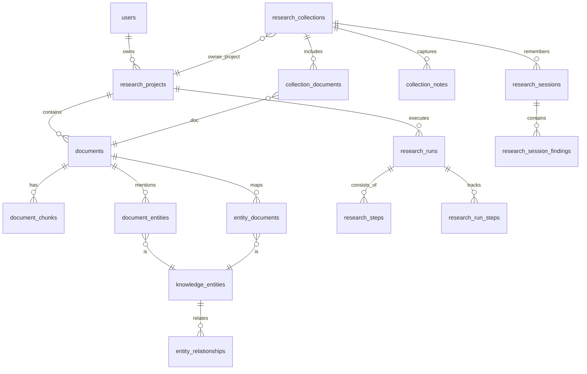

# ResearchOS

**AI Research Intelligence Workspace for multi-document analysis, cited synthesis, and structured knowledge extraction.**

[Live demo](https://ai-research-assistant-liart.vercel.app) · Next.js · Supabase · pgvector · OpenAI / Claude · TypeScript

```text
Recruiter login
Email: recruiter@researchos.dev
Password: ResearchOS-Demo-2026!
```

> Shared portfolio account. Use non-confidential test documents, or create a separate account from the sign-up screen.


---

## Why ResearchOS

ResearchOS helps researchers, analysts, students, and AI teams organize large document collections, retrieve relevant information, synthesize findings across sources, and generate reusable research intelligence from unstructured documents.

Most AI document tools summarize one file at a time. ResearchOS is built for the more realistic workflow: multiple sources, evidence-backed answers, cross-document comparison, extracted entities, reusable notes, and exportable research outputs.

---

## At A Glance

| Product Capability | What It Demonstrates |
| --- | --- |
| Multi-document collections | Cross-source research workflows, not isolated summarization |
| Cited Q&A and synthesis | RAG-style retrieval with source references |
| Knowledge graph | Structured extraction of entities, claims, insights, and relationships |
| Research pipeline visibility | Upload, chunk, retrieve, analyze, synthesize, export |
| Usage analytics | Token estimates, provider usage, latency, and retrieval metrics |

---

## Product Proof

| Dashboard | Collection Workspace |
| --- | --- |
|  |  |

| Synthesis Report | Knowledge Graph |
| --- | --- |
|  |  |

| Research Chat |
| --- |
|  |

---

## Technical Highlights

- Multi-document semantic retrieval with pgvector.
- Token-aware chunking and context optimization.
- AI provider abstraction layer for OpenAI and Anthropic.
- Strict Zod contracts for AI-generated summaries, insights, keywords, citations, and reports.
- Structured knowledge extraction for entities, claims, linked insights, and relationships.
- Cross-document synthesis workflows for themes, contradictions, gaps, opportunities, and recommendations.
- Persistent research memory through notes, pins, saved sessions, reports, and exports.
- Supabase Auth, Storage, Postgres, RLS policies, and private document buckets.
- Cached AI response reuse and graceful fallback when provider quota is unavailable.

---

## Architecture


The system is organized around four layers:

| Layer | Responsibility |
| --- | --- |
| Workspace UI | Uploads, projects, collections, chat, knowledge graph, analytics, exports |
| Server API | Auth checks, validation, rate limits, document processing, export generation |
| AI pipeline | Chunking, retrieval, prompt templates, provider calls, structured output validation |
| Research memory | Supabase Storage, Postgres, pgvector chunks, entities, reports, sessions |

<details>
<summary>Database ER diagram</summary>



</details>

---

## Stack

| Layer | Technology |
| --- | --- |
| App | Next.js App Router, React 19, TypeScript |
| UI | Tailwind CSS, lucide-react |
| Backend | Next.js API routes, Zod validation |
| Data | Supabase Auth, Storage, Postgres, pgvector |
| AI | OpenAI embeddings / chat, Anthropic Claude chat |
| Quality | Vitest, ESLint, npm audit |

---

## Local Setup

```bash
npm install
Copy-Item .env.example .env.local
npm run dev
```

Required environment variables:

```bash
NEXT_PUBLIC_SUPABASE_URL=
NEXT_PUBLIC_SUPABASE_ANON_KEY=
SUPABASE_SERVICE_ROLE_KEY=
SUPABASE_SECRET_KEY=

OPENAI_API_KEY=
OPENAI_CHAT_MODEL=gpt-4o-mini
OPENAI_EMBEDDING_MODEL=text-embedding-3-small

ANTHROPIC_API_KEY=
ANTHROPIC_MODEL=claude-sonnet-4-6
AI_PROVIDER=anthropic

DEMO_MODE=false
```

Apply Supabase migrations in `supabase/migrations` from `0001` through `0007`.

---

## Verification

```bash
npm run lint
npm test
npm run build
npm audit --omit=dev
```

Latest live smoke test covers recruiter login, document upload, collection creation, multi-document synthesis, knowledge extraction, the knowledge graph, analytics, and export-ready workspace state.
