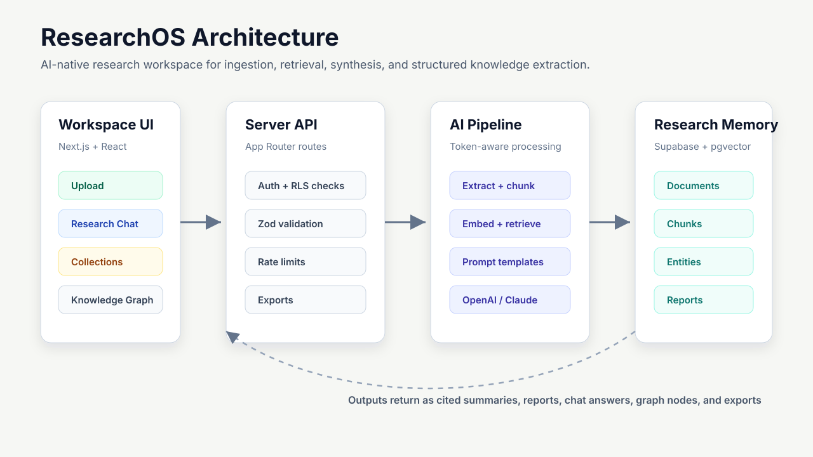
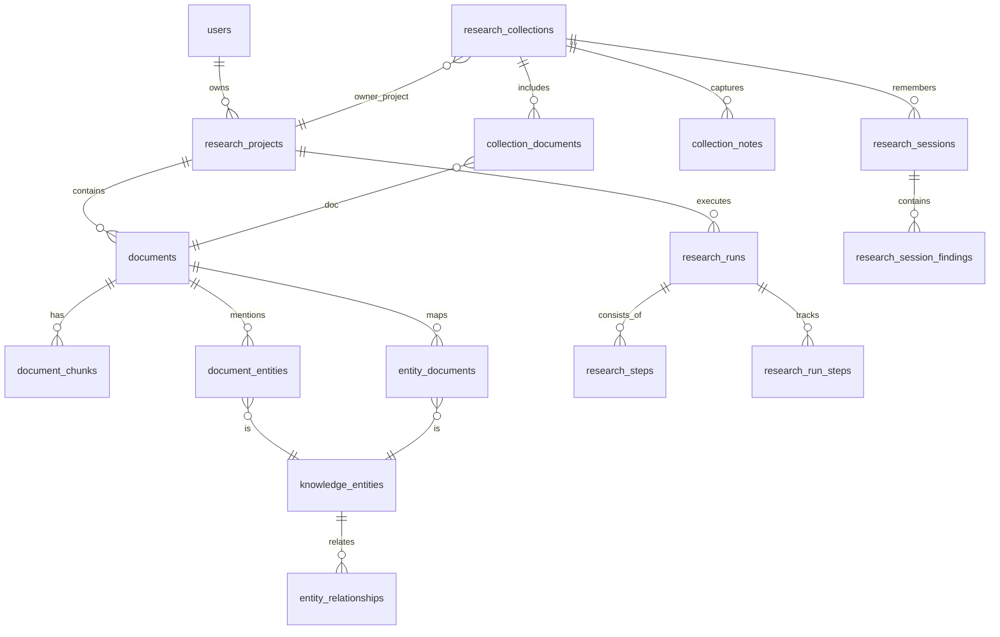

# ResearchOS

**ResearchOS is an AI Research Intelligence Workspace for turning document collections into cited summaries, cross-source synthesis, structured knowledge, and reusable research outputs.**

[Live demo](https://ai-research-assistant-liart.vercel.app) · Next.js · Supabase · pgvector · OpenAI / Claude · TypeScript

```text
Recruiter login
Email: recruiter@researchos.dev
Password: ResearchOS-Demo-2026!
```

> This is a shared portfolio demo account. Please use non-confidential test documents, or create a separate account from the sign-up screen.


## Why This Exists

ResearchOS helps researchers, analysts, and AI teams organize large document collections, extract structured knowledge, synthesize findings across sources, and generate reusable research intelligence.

Most AI document tools stop at single-file summaries. ResearchOS is built around the harder workflow: upload multiple sources, retrieve the right evidence, compare what sources agree or disagree on, preserve citations, and turn the result into a usable research workspace.

## Product Preview

| Collection Workspace | Synthesis Report |
| --- | --- |
|  |  |

| Knowledge Graph | Research Chat |
| --- | --- |
|  |  |

## Core Capabilities

- **Document ingestion:** PDF, TXT, and DOCX upload with text extraction, chunking, hashing, and storage.
- **Cited research outputs:** summaries, insights, keywords, document Q&A, collection chat, and exportable Markdown / JSON reports.
- **Multi-document synthesis:** unified summaries, source comparisons, contradictions, research gaps, trends, opportunities, and recommendations.
- **Knowledge extraction:** entities, claims, linked insights, relationships, and an interactive graph explorer.
- **Research workflow visibility:** pipeline stages, run history, analytics cards, provider usage, token estimates, and retrieval metrics.
- **Production-minded fallback behavior:** pgvector retrieval when embeddings are available, lexical fallback when provider quota is unavailable, and graceful provider-error handling.

## Technical Highlights

- Multi-document retrieval architecture for project-level and collection-level Q&A.
- Supabase Postgres schema with pgvector chunk search and row-level security.
- Token-aware chunking pipeline with content hashing and cache-aware processing.
- Reusable prompt template layer with strict Zod output contracts.
- OpenAI / Anthropic provider abstraction with server-only API calls.
- Structured knowledge extraction for entities, claims, insights, and graph relationships.
- Persistent research memory through notes, pinned answers, saved sessions, reports, and exports.
- Recruiter-ready SaaS UX with auth, upload states, command palette, responsive panels, and analytics.

## Architecture



<details>
<summary>Database ER diagram</summary>



</details>

## Stack

| Layer | Technology |
| --- | --- |
| App | Next.js App Router, React 19, TypeScript |
| UI | Tailwind CSS, lucide-react |
| Backend | Next.js API routes, Zod validation |
| Data | Supabase Auth, Storage, Postgres, pgvector |
| AI | OpenAI embeddings / chat, Anthropic Claude chat |
| Quality | Vitest, ESLint, npm audit |

## Local Setup

```bash
npm install
Copy-Item .env.example .env.local
npm run dev
```

Required environment variables:

```bash
NEXT_PUBLIC_SUPABASE_URL=
NEXT_PUBLIC_SUPABASE_ANON_KEY=
SUPABASE_SERVICE_ROLE_KEY=
SUPABASE_SECRET_KEY=

OPENAI_API_KEY=
OPENAI_CHAT_MODEL=gpt-4o-mini
OPENAI_EMBEDDING_MODEL=text-embedding-3-small

ANTHROPIC_API_KEY=
ANTHROPIC_MODEL=claude-sonnet-4-6
AI_PROVIDER=anthropic

DEMO_MODE=false
```

Apply Supabase migrations in `supabase/migrations` from `0001` through `0007`.

## Verification

```bash
npm run lint
npm test
npm run build
npm audit --omit=dev
```

Latest live smoke test covers recruiter login, document upload, collection creation, multi-document synthesis, knowledge extraction, the knowledge graph, analytics, and export-ready workspace state.
