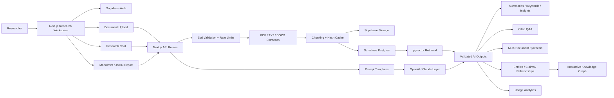
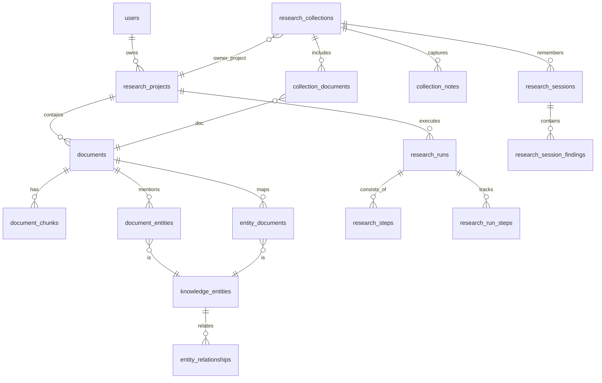

# ResearchOS

ResearchOS is an AI research intelligence workspace built with Next.js, Supabase, pgvector, and server-side OpenAI / Claude provider integrations. It turns uploaded PDFs, TXT files, and DOCX documents into cited summaries, cross-document reports, structured knowledge, research notes, and exportable research artifacts.

## Live Demo

Demo URL: https://ai-research-assistant-liart.vercel.app

Recruiter login:

```text
Username: recruiter@researchos.dev
Password: ResearchOS-Demo-2026!
```

This is a shared demo account for portfolio review. Do not upload confidential documents. You can also create a separate account from the sign-up screen.

## What It Does

- Upload PDFs, TXT, and DOCX files.
- Extract and chunk document text with token-aware limits.
- Store documents, chunks, notes, reports, and research memory in Supabase.
- Retrieve relevant chunks with pgvector when embeddings are available, with lexical fallback when provider quota is unavailable.
- Generate summaries, insights, keywords, cited Q&A, and Markdown / JSON exports.
- Group documents into research collections for multi-document comparison.
- Generate unified reports, source comparisons, executive briefs, research gaps, trends, opportunities, and recommendations.
- Extract entities, claims, linked insights, and relationships into an interactive knowledge graph.
- Show research pipeline status, usage analytics, provider mix, retrieval efficiency, and saved research sessions.
- Keep all AI calls server-side with Zod-validated output contracts.

## Architecture



## Database Schema



## Stack

- Next.js App Router
- React 19
- TypeScript
- Tailwind CSS
- Supabase Auth, Storage, Postgres, and pgvector
- OpenAI embeddings / chat support
- Anthropic Claude chat support
- Zod validation
- Vitest

## Local Setup

```bash
npm install
Copy-Item .env.example .env.local
npm run dev
```

Required environment variables:

```bash
NEXT_PUBLIC_SUPABASE_URL=
NEXT_PUBLIC_SUPABASE_ANON_KEY=
SUPABASE_SERVICE_ROLE_KEY=
SUPABASE_SECRET_KEY=

OPENAI_API_KEY=
OPENAI_CHAT_MODEL=gpt-4o-mini
OPENAI_EMBEDDING_MODEL=text-embedding-3-small

ANTHROPIC_API_KEY=
ANTHROPIC_MODEL=claude-sonnet-4-6
AI_PROVIDER=anthropic

DEMO_MODE=false
```

Never commit real API keys. Production secrets should be configured in Vercel environment variables.

## Supabase Setup

Apply the migrations in `supabase/migrations` in order:

- `0001_researchos.sql`
- `0002_research_intelligence_workspace.sql`
- `0003_entity_relationships_and_cache.sql`
- `0004_production_hardening.sql`
- `0005_pdf_schema_alignment.sql`
- `0006_research_workspace_upgrade.sql`
- `0007_interactive_research_intelligence.sql`

These migrations create the document workspace, pgvector retrieval, private storage bucket, collections, knowledge graph tables, research sessions, analytics, rate limits, and compatibility views used by the app.

## Verification

```bash
npm run lint
npm test
npm run build
```

Current live verification covers authenticated login, document upload, collection creation, multi-document synthesis, knowledge extraction, the knowledge graph, analytics, and export-ready workspace state.
