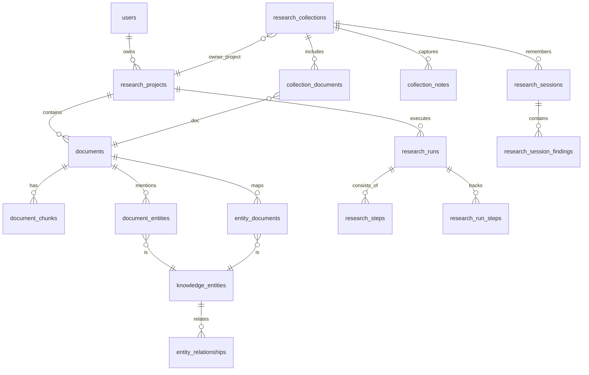

# ResearchOS Architecture

## System Overview

ResearchOS is a Next.js App Router application that turns uploaded research documents into structured, reusable intelligence assets. The product shape follows the same portfolio-grade pattern used in the prior builds: real SaaS workflow first, demo fallback second, server-only AI calls, explicit storage boundaries, and deployable documentation.

The application has four runtime layers:

- **Client workspace:** React components for auth, ingestion, project navigation, collection dashboards, document viewing, AI outputs, research chat, interactive knowledge graph exploration, research intelligence dashboard, analytics, notes, highlights, saved sessions, and exports.
- **API routes:** Next.js server routes for upload, summarization, extraction, keyword generation, document chat, collection synthesis, knowledge extraction, entity detail reads, analytics, project reads, notes, highlights, pinning, and exports.
- **Research pipeline:** document parsing, normalization, chunking, hashing, query rewriting, hybrid retrieval, contextual compression, prompt rendering, provider abstraction, embedding generation, multi-document synthesis, advanced reasoning reports, structured output validation, session memory, and export generation.
- **Supabase backend:** Auth sessions, private Storage bucket, Postgres metadata tables, row-level security, and pgvector retrieval.

## Data Flow

1. A user signs in through Supabase Auth.
2. The browser uploads a PDF, TXT, or DOCX to `POST /api/upload-document`.
3. The server validates size/type, extracts text, rejects oversized extracted text, chunks the document, generates embeddings when OpenAI is configured, and stores the file in private Supabase Storage.
4. Metadata, raw text, chunks, and optional embeddings are stored under the authenticated user ID.
5. AI actions load project chunks, render versioned prompt templates, call the configured provider server-side, validate JSON output with Zod, and cache outputs by document/chunk hash.
6. Q&A rewrites the question, embeds the expanded query, retrieves relevant chunks through pgvector plus lexical fallback, reranks results, removes duplicate context, compresses selected chunks, and returns cited answers.
7. Collections attach multiple projects, retrieve source chunks across documents, and generate unified reports, source comparisons, executive briefs, trend analysis, and research gap outputs.
8. Knowledge extraction stores entities, document-to-entity links, concept relationships, linked insights, and source-backed claims so research memory can be reused across the workspace.
9. The D3 knowledge graph renders stored entities and relationships with zoom, pan, type filtering, relationship strength, and an entity inspector that links back to documents, insights, and claims.
10. Advanced reasoning report kinds generate confidence scores, evidence strength, reliability rankings, hypotheses, claim validation, unanswered questions, missing topics, and suggested investigations.
11. Research sessions preserve investigation context, memory fields, and reusable findings at the collection level.
12. Exports assemble Markdown or JSON from projects or collections, including AI outputs, research chat, entities, claims, notes, highlights, sessions, and citations.
13. Mutating and AI routes use local rate limits plus the Supabase `check_rate_limit(...)` RPC when `SUPABASE_SERVICE_ROLE_KEY` is configured.

## Key Modules

- `src/app/api/*`: public HTTP interface. All mutating and AI routes require a server-verified user unless the app is intentionally running without Supabase configuration in demo mode.
- `src/lib/research/repository.ts`: data-access boundary for Supabase and in-memory demo mode.
- `src/lib/research/processing.ts`: AI pipeline orchestration, cache checks, hybrid RAG retrieval, collection synthesis, knowledge extraction, analytics recording, and demo fallback policy.
- `src/components/knowledge-graph.tsx`: D3 force-directed entity graph with entity type filtering, zoom, pan, and click-to-inspect behavior.
- `src/lib/ai/*`: provider abstraction, embeddings, prompt templates, and Zod schemas.
- `src/lib/documents/*`: extraction, normalization, token estimation, chunking, and prompt compaction.
- `supabase/migrations/0001_researchos.sql`: base schema, indexes, storage bucket, RLS policies, and `match_document_chunks` RPC.
- `supabase/migrations/0002_research_intelligence_workspace.sql`: collection, synthesis, knowledge, research chat, workflow progress, usage analytics, and saved view tables.
- `supabase/migrations/0003_entity_relationships_and_cache.sql`: document-to-entity links, concept relationships, and reusable Q&A cache.
- `supabase/migrations/0004_production_hardening.sql`: persistent API rate-limit buckets, action records, and `check_rate_limit(...)`.
- `supabase/migrations/0005_pdf_schema_alignment.sql`: PDF-aligned `owner_project_id` and compatibility views for `research_runs` and `research_steps`.
- `supabase/migrations/0006_research_workspace_upgrade.sql`: collection notes, expanded analyst report kinds, and compatibility views for `entity_documents` and `research_run_steps`.
- `supabase/migrations/0007_interactive_research_intelligence.sql`: advanced reasoning report kinds plus saved research sessions and session findings.

## Storage Model

Supabase tables:

- `research_projects`
- `documents`
- `document_chunks`
- `ai_outputs`
- `research_notes`
- `highlights`
- `qa_messages`
- `research_exports`
- `research_collections`
- `collection_documents`
- `collection_notes`
- `synthesis_reports`
- `knowledge_entities`
- `document_entities`
- `entity_documents` compatibility view over `document_entities`
- `entity_relationships`
- `linked_insights`
- `research_claims`
- `collection_qa_messages`
- `research_pipeline_runs`
- `research_pipeline_steps`
- `research_runs` compatibility view over `research_pipeline_runs`
- `research_steps` compatibility view over `research_pipeline_steps`
- `research_run_steps` compatibility view over `research_pipeline_steps`
- `research_sessions`
- `research_session_findings`
- `ai_usage_metrics`
- `saved_research_views`
- `qa_response_cache`
- `api_rate_limits`
- `action_records`

Storage bucket:

- `research-documents`, private, path-scoped by authenticated user ID.

Vector retrieval:

- `document_chunks.embedding vector(1536)`
- `match_document_chunks(match_project_id, query_embedding, match_count)`

## Database Schema ER Diagram

This is the Mermaid ER diagram requested in the PDF. The implementation keeps the application table names `research_pipeline_runs` and `research_pipeline_steps`, and migration `0005_pdf_schema_alignment.sql` exposes PDF-aligned `research_runs` and `research_steps` compatibility views over those tables.



## PDF API Contracts

The PDF API examples are supported alongside the existing UI payloads:

```ts
const CreateCollectionSchema = z.object({
  title: z.string().min(2),
  description: z.string().max(500).optional(),
  ownerProjectId: z.string().min(1).optional(),
});

const AddDocSchema = z.object({
  documentId: z.string().min(1),
});

const SynthesizeSchema = z.object({
  kind: synthesisReportKindSchema.default("combined_summary"),
  focusQuestion: z.string().max(500).optional(),
});

const CreateResearchSessionSchema = z.object({
  title: z.string().min(3).max(120),
  summary: z.string().max(1200).optional(),
  memory: z.record(z.string(), z.unknown()).optional(),
  findings: z.array(z.object({
    findingType: z.string().min(2).max(60),
    title: z.string().min(3).max(140),
    body: z.string().min(3).max(1600),
    citations: z.array(citationSchema).optional(),
    confidence: z.enum(["low", "medium", "high"]).optional(),
  })).max(8).optional(),
});

const QueryEntitySchema = z.object({
  query: z.string().max(120).optional(),
  collectionId: z.string().min(1).optional(),
});
```

Compatibility routes:

- `POST /api/collections/:id/add-document` aliases the implemented document attachment route.
- `POST /api/collections/:id/documents` accepts either `projectId` or `documentId`.
- `DELETE /api/collections/:id/documents` and `DELETE /api/collections/:id/add-document` remove a source from a collection.
- `POST /api/collections/:id/notes` saves cross-document collection notes.
- `GET /api/collections/:id/sessions` lists saved collection investigation sessions.
- `POST /api/collections/:id/sessions` saves collection-level research memory and linked findings.
- `GET /api/entities?query=...` searches entities across the workspace.
- `GET /api/entities?collectionId=...&query=...` searches inside one collection.

## PDF Implementation Coverage

- Multi-document collections: `research_collections`, `collection_documents`, `collection_notes`, `synthesis_reports`, collection dashboard, source removal, synthesis routes, and collection chat.
- Knowledge layer: `knowledge_entities`, `document_entities`, `entity_relationships`, linked insights, claims, entity list, and entity detail route.
- Interactive graph: D3 force layout, entity type filtering, zoom/pan controls, relationship strength highlighting, and entity inspector.
- Citation tracing: structured citation objects include chunk, document, project, quote, confidence, and UI jump targets.
- Workflow visibility: `research_pipeline_runs`, `research_pipeline_steps`, progress UI, and PDF-aligned `research_runs` / `research_steps` views.
- Retrieval and performance: pgvector retrieval, query rewriting, lexical fallback, hybrid reranking, duplicate chunk reduction, contextual compression, reusable Q&A cache, token estimates, provider latency, and analytics dashboard.
- Research reasoning: confidence reports, hypotheses, claim validation, evidence summaries, source reliability rankings, unanswered questions, missing topics, and suggested investigations.
- Session memory: `research_sessions`, `research_session_findings`, saved investigation UI, and collection-level memory fields.
- Productivity UX: global search, command palette, keyboard shortcut support, pinned answers, saved workspace panels, responsive layouts, and progressive loading states.
- Production hardening: persistent rate limits, action records, CSP/security headers, local secret isolation, and documented dependency advisory tracking.

## Configuration

Local secrets and deployment secrets live outside Git:

- `.env.local` for local development
- Vercel project environment variables for production
- `.env.example` only for placeholders

Required Supabase values:

- `NEXT_PUBLIC_SUPABASE_URL`
- `NEXT_PUBLIC_SUPABASE_ANON_KEY`

Optional AI values:

- `OPENAI_API_KEY`
- `ANTHROPIC_API_KEY`
- `AI_PROVIDER=openai|anthropic`
- `DEMO_MODE=true|false`

`SUPABASE_SERVICE_ROLE_KEY` or `SUPABASE_SECRET_KEY` is optional but recommended for production. When present, server routes use it for persistent rate limiting and action records. It must never be exposed to the browser.

## Deployment Notes

The app was pushed to GitHub without local credentials. The Vercel deployment built successfully before credentials were added locally. Do not redeploy with local secrets unless they are configured intentionally as Vercel environment variables through the Vercel dashboard or CLI secret flow.

Supabase migrations still need to be applied to the target Supabase project before authenticated production use. Without the migrations, the app can authenticate but project, collection, entity detail, persistent rate-limit, and action-record operations will fail because tables, policies, storage bucket, and RPC functions are missing.
